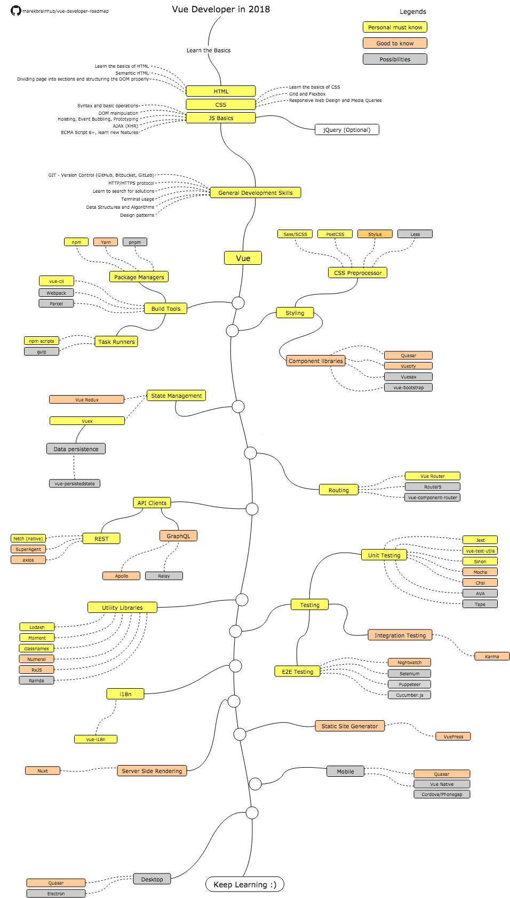

# Vue Developer Roadmap

> Roadmap to becoming a Vue developer in 2019

Below you can find a chart demonstrating the paths that you can take and the libraries that you would want to learn in order to become a Vue developer. This chart is inspired by [adam-golab's React roadmap](https://github.com/adam-golab/react-developer-roadmap) (with permission) as a tip for everyone who asks me "What should I learn next as a Vue developer?"

## Disclaimer
> The purpose of this roadmap is to give you an idea about the ecosystem. The road map will guide you if you are confused about what to learn next, rather than encourage you to pick what is hip and trendy. You should grow some understanding of why one tool would be better suited for some cases than the other and remember hip and trendy does not always mean best suited for the job

## Roadmap

## Resources

1. Basics
    1. HTML
        * Learn the basics of HTML
        * Make a few pages as an exercise
    2. CSS
        * Learn the basics of CSS
        * Style pages from previous step
        * Build a page with grid and flexbox
    3. JS Basics
        * Get familiar with the syntax
        * Learn basic operations on DOM
        * Learn mechanisms typical for JS (Hoisting, Event Bubbling, Prototyping)
        * Make some AJAX (XHR) calls
        * Learn new features (ECMA Script 6+)
        * Additionally, get familiar with jQuery library
2. General Development Skills
    1. Learn GIT, create a few repositories on GitHub, share your code with other people
    2. Know HTTP(S) protocol, request methods (GET, POST, PUT, PATCH, DELETE, OPTIONS)
    3. Don't be afraid of using Google, [Power Searching with Google](http://www.powersearchingwithgoogle.com/)
    4. Get familiar with terminal, configure your shell (bash, zsh, fish)
    5. Read a few books about algorithms and data structures
    6. Read a few books about design patterns
3. Learn Vue on [official website](https://vuejs.org/v2/guide/index.html) or complete some [courses](https://egghead.io/courses/develop-basic-web-apps-with-vue-js)
4. Get familiar with tools that you will be using
    1. Package Managers
        * [npm](https://www.npmjs.com/)
        * [yarn](https://yarnpkg.com/lang/en/)
        * [pnpm](https://pnpm.js.org/)
    2. Task Runners
        * [npm scripts](https://docs.npmjs.com/misc/scripts)
        * [gulp](https://gulpjs.com/)
    * [vue-cli](https://cli.vuejs.org/)
    * [Webpack](https://webpack.js.org/)
    * [Parcel](https://parceljs.org/)
    * [Storybook](https://storybook.js.org/)
5. Styling
    1. CSS Preprocessor
        * [Sass/CSS](https://sass-lang.com/)
        * [PostCSS](https://postcss.org/)
        * [Less](http://lesscss.org/)
        * [Stylus](http://stylus-lang.com/)
    2. Component libraries
        * [Quasar](https://quasar-framework.org/)
        * [Vuetify](https://vuetifyjs.com/en/)
        * [iView](https://www.iviewui.com/)
        * [Vuesax](https://lusaxweb.github.io/vuesax/)
        * [bootstrap-vue](https://bootstrap-vue.js.org/)
6. State Management
    2. [Vuex](https://vuex.vuejs.org/)
        1. Data persistence
            * [vue-persistedstate](https://github.com/robinvdvleuten/vuex-persistedstate)
7. Routing
    * [Vue Router](https://router.vuejs.org/)
    * [Router5](https://router5.js.org/)
    * [vue-component-router](https://github.com/blocka/vue-component-router)
10. API Clients
    1. REST
        * [Fetch](https://developer.mozilla.org/en-US/docs/Web/API/Fetch_API)
        * [SuperAgent](https://visionmedia.github.io/superagent/)
        * [axios](https://github.com/axios/axios)
    2. GraphQL
        * [Apollo](https://www.apollographql.com/docs/react/)
        * [Relay](https://facebook.github.io/relay/)
11. Utility Libraries
    * [Lodash](https://lodash.com/)
    * [Moment](https://momentjs.com/)
    * [Numeral](http://numeraljs.com/)
    * [RxJS](http://reactivex.io/)
    * [Ramda](https://ramdajs.com/)
12. Testing
    1. Unit Testing
        * [Jest](https://facebook.github.io/jest/)
        * [vue-test-utils](https://github.com/vuejs/vue-test-utils/)
        * [Sinon](http://sinonjs.org/)
        * [Mocha](https://mochajs.org/)
        * [Chai](http://www.chaijs.com/)
        * [AVA](https://github.com/avajs/ava)
        * [Tape](https://github.com/substack/tape)
    2. End to End Testing
        * [Nightwatch](http://nightwatchjs.org/)
        * [Selenium](https://www.seleniumhq.org/), [Webdriver](http://webdriver.io/)
        * [Puppeteer](https://pptr.dev/)
        * [Cucumber.js](https://github.com/cucumber/cucumber-js)
    3. Integration Testing
        * [Karma](https://karma-runner.github.io/)
13. Internationalization
    * [vue-i18n](https://kazupon.github.io/vue-i18n/)
14. Server Side Rendering
    * [Nuxt](https://nuxtjs.org/)
15. Static Site Generator
    * [VuePress](https://vuepress.vuejs.org/)
17. Mobile
    * [Quasar](https://quasar-framework.org/)
    * [Vue Native](https://github.com/GeekyAnts/vue-native-core/)
    * [Nativescript Vue](https://nativescript-vue.org/)
    * [Weex](https://weex.incubator.apache.org/)
18. Desktop
    * [Quasar](https://quasar-framework.org/)
    * [Electron](https://electronjs.org/)
    * [NW.js](https://nwjs.io/)
    * [Vuido](https://vuido.mimec.org/)

## Wrap Up

If you think the roadmap can be improved, please do open a PR with any updates and submit any issues. Also, I will continue to improve this, so you might want to star this repository to revisit.

## Contribution

The roadmap is built using [Draw.io](https://www.draw.io/). Project file can be found at `/src` directory. To modify it, open draw.io, click **Open Existing Diagram** and choose `xml` file with project. It will open the roadmap for you, update it, upload and update the images in readme and create a PR (export as png).

- Open pull request with improvements
- Discuss ideas in issues
- Spread the word

## License

